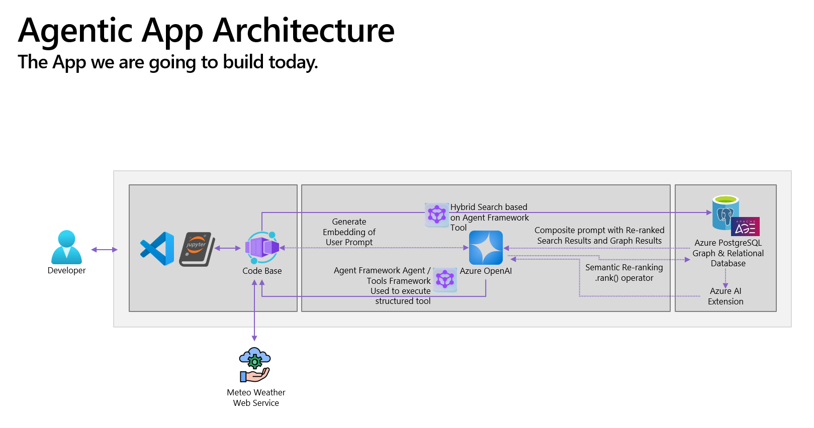

# LAB515: Build an Agentic App with PostgreSQL, GraphRAG, and Agent Framework

## Overview

This lab guides you through developing an agent-driven, Retrieval-Augmented Generation (RAG) application that explores U.S. Case Law data. You'll learn how to combine PostgreSQL's powerful database capabilities with AI techniques to create a legal research assistant capable of providing accurate and contextually relevant answers.

## Architecture



## What You'll Build

- A Microsoft Agent Framework Agent that can reason over legal cases stored in PostgreSQL
- A system that utilizes vector embeddings for semantic search
- AI function tools for database search and external data retrieval 
- An application enhanced with the GraphRAG pattern for improved answer quality

## Key Technologies

- **Azure Database for PostgreSQL**: Database platform with AI extensions
- **Microsoft Agent Framework**: Framework for building AI agents with function tools
- **Azure OpenAI**: For embeddings and LLM chat completions
- **PostgreSQL Extensions**: Vector and Graph capabilities (DiskANN, AGE)
- **Python**: For agent development and database interaction

## Project Structure

```
├── LICENSE                     # MIT License file
├── azure.yaml                  # Azure Developer CLI configuration
├── requirements.txt            # Python package dependencies
├── Code/
│   └── lab.ipynb              # Main Jupyter notebook tutorial
├── Dataset/
│   └── cases.csv              # Legal case dataset
├── Docs/
│   └── lab_manual.md          # Detailed lab instructions
│   └── images/                # Architecture diagrams and screenshots
├── Scripts/
│   ├── create_graph.sql       # SQL script for graph creation
│   ├── get_env.ps1            # Script to get environment variables
│   ├── get_user_token.ps1     # Script to get PostgreSQL access token
│   ├── initialize_dataset.sql # Database initialization script
│   ├── load_age.ps1           # Apache AGE installation script
│   └── write_env.ps1          # Environment variable setup script
├── infra/
│   ├── deployment_script.ps1  # Deployment script
│   ├── main.bicep             # Main Azure Bicep deployment template
│   ├── main.parameters.json   # Bicep parameters file
│   └── pg.bicep               # PostgreSQL-specific Bicep template
└── Archive/                   # Legacy scripts and configurations
```

## Prerequisites

- Azure subscription with access to Azure OpenAI
- Visual Studio Code with the PostgreSQL extension
- Python environment with necessary libraries:
  - PostgreSQL connectivity (`psycopg`, `psycopg-binary`, `psycopg-pool`)
  - Modeling and validation (`pydantic`)
  - OpenAI and Agent Framework integration (`openai`, `agent-framework`)
  - Notebook compatibility (`nest_asyncio`, `ipykernel`)
  - Azure authentication (`azure-identity`)
  - Environment management (`python-dotenv`)

## Lab Sections

1. **Setup Azure PostgreSQL Database**:
   - Database connection and configuration
   - Install the `azure_ai` extension
   - Configure Azure OpenAI connectivity

2. **Using AI-driven features in PostgreSQL**:
   - Pattern matching queries
   - Semantic vector search using embeddings
   - DiskANN indexing for fast vector similarity search

3. **Building the Agent Application**:
   - Setting up Microsoft Agent Framework
   - Creating database search AI function tools
   - Implementing semantic reranking
   - Adding external data sources (weather API)
   - Testing and improving the agent


## Deploying to Azure

Follow these steps to deploy a PostgreSQL Flexible Server to Azure with the pgvector extension enabled:

1. Login to your Azure account:

    ```shell
    azd auth login
    ```

2. Create a new azd environment:

    ```shell
    azd env new
    ```

    Enter a name that will be used for the resource group.
    This will create a new folder in the `.azure` folder, and set it as the active environment for any calls to `azd` going forward.

3. Run this command to provision all the resources:

    ```shell
    azd provision
    ```

    This will create a new resource group, and create the PostgreSQL Flexible server and Azure OpenAI resources in that resource group.
    It will also create a `.env` file in the root of the project, which contains the connection information for the PostgreSQL server and Azure OpenAI.

## Getting Started

1. Follow the instructions in `Docs/lab_manual.md` to setup your environment
2. Open `Code/lab.ipynb` in Visual Studio Code to follow the step-by-step guide
3. Run the PowerShell scripts in the `Scripts/` folder to configure your environment and database

## Additional Resources

- [GraphRAG Solution for Azure Database for PostgreSQL](https://aka.ms/pg-graphrag)
- [Graph data in Azure Database for PostgreSQL](https://aka.ms/age-blog)
- [PostgreSQL extension for Visual Studio Code](https://marketplace.visualstudio.com/items?itemName=ms-ossdata.vscode-postgresql)
- [Microsoft Agent Framework Documentation](https://microsoft.github.io/agent-framework/)

## License

This project is licensed under the MIT License - see the LICENSE file for details.